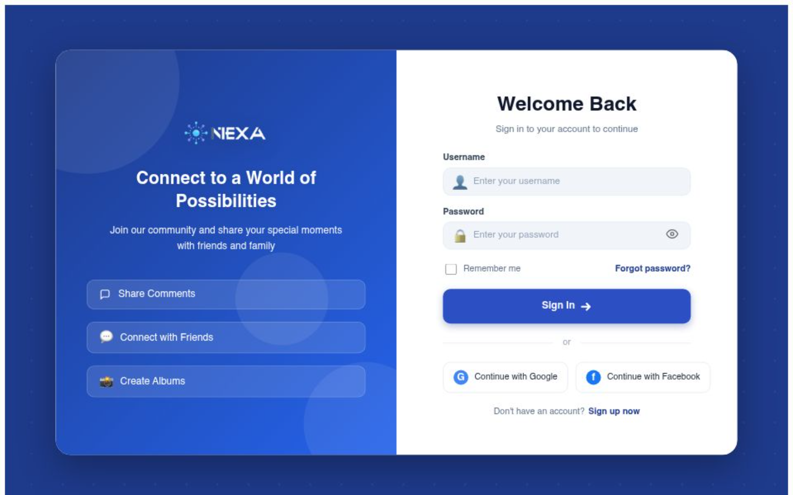
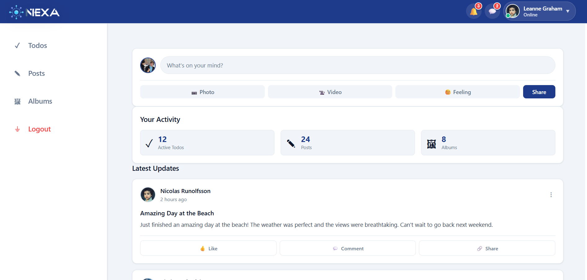
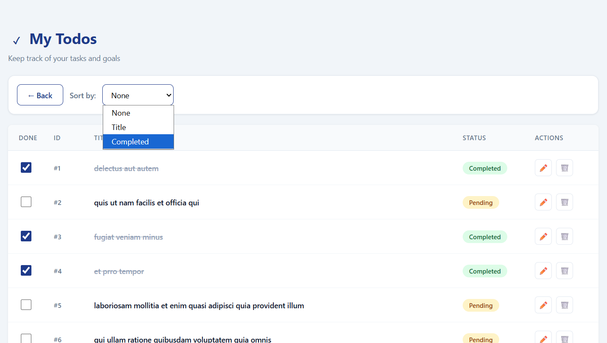
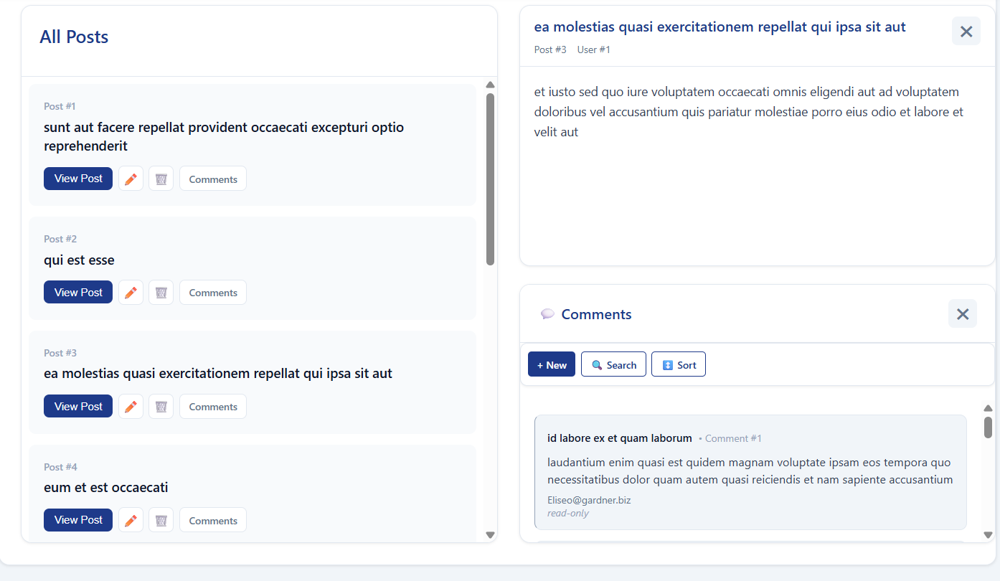
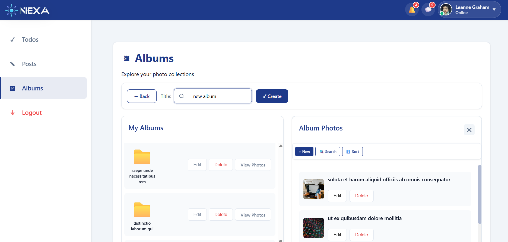

# NEXA - Full-Stack Cloud-Based Social Platform

## Overview

NEXA is a production-style full-stack web application built with React, Node.js, Express, and MySQL.

The platform simulates a modern social-content management system where authenticated users can manage todos, posts, comments, albums, and photos through a scalable RESTful architecture.

The current version uses a real AWS managed database (Amazon RDS) providing persistent data storage, hosted entirely on AWS EC2, demonstrating a complete cloud-native CI/CD deployment workflow.

---

## Live Deployment

### Frontend & Backend API

http://18.235.2.62/

### Database

Cloud-hosted Amazon RDS MySQL

---

## Screenshots

### Authentication



### Dashboard



### Todos Management



### Posts & Comments



### Albums & Photos



---

## Core Features

- User registration and authentication
- Todos management
- Posts and comments system
- Albums and photos management
- Incremental photo loading
- Nested relational navigation
- Protected routes
- Persistent session management
- Cloud database integration
- Full CRUD functionality
- Automated CI/CD Pipeline

---

## Full-Stack Architecture

User Browser
↓
Nginx Reverse Proxy (AWS EC2)
↓
React Frontend (Vite) & Express Backend Server (PM2)
↓
Amazon RDS MySQL Database

---

## Tech Stack

### Frontend

* React
* React Router DOM
* Context API
* Axios
* Vite
* CSS

### Backend

* Node.js
* Express 5
* MySQL
* mysql2
* dotenv
* cors

### Deployment & Infrastructure

* AWS EC2 (Ubuntu)
* Amazon RDS MySQL
* Nginx (Reverse Proxy)
* PM2 (Process Manager)
* GitHub Actions (Automated CI/CD)

---

## Repository Structure


project/
├── client/   (React frontend)
└── server/   (Express + MySQL backend)


Additional documentation:

* client/README.md
* server/README.md

---

## Running Locally

### Backend

```bash
cd server
npm install
npm run dev
```

### Frontend

```bash
cd client
npm install
npm run dev
```

Frontend:

```text
http://localhost:5173
```

---

## Environment Variables

### Server

```env
DB_HOST=localhost
DB_USER=your_username
DB_PASSWORD=your_password
DB_NAME=your_database
PORT=5000
```

---

## Project Purpose

This project was built to demonstrate:

* Full-stack engineering skills
* Real backend development
* Relational database integration
* REST API architecture
* Frontend scalability patterns
* Cloud deployment workflows
* Maintainable software architecture

---

## Author

**Avital Lugassi**  
- GitHub: https://github.com/AvitalLugassi  
- LinkedIn: https://linkedin.com/in/avital-lugassi

**Deployed By:**
- **Abdullah Zuberi**